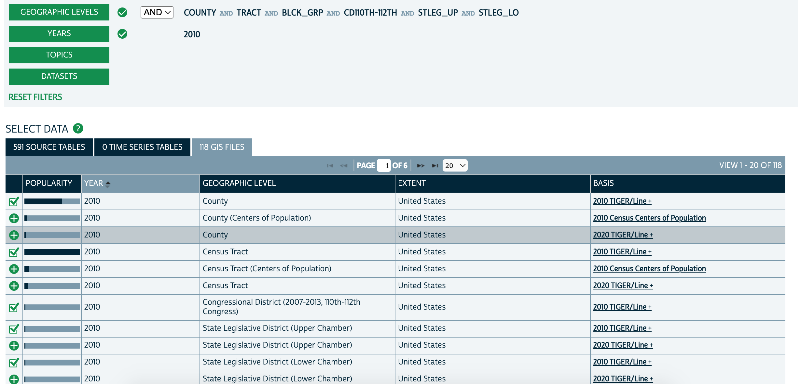

# Census Swapping

## Requirements
- `python3`, and the following packages:
  - [numpy](https://numpy.org/)
  - [scipy](https://scipy.org/)
  - [pandas](https://pandas.pydata.org/)
  - [geopandas](https://geopandas.org/en/stable/) (for swapping)
  - [Gurobi](https://www.gurobi.com/), with a valid license and the python package `gurobipy` installed (`python3 -m pip install gurobipy`)

## Basic setup
Modify `params.json` to reflect the state you want.

Create a directory `data` and a directory `output`. Modify `params.json` to point to these directories.

Name the unprotected database `output/[state]/[name]_synthetic.csv`.

## Swapping
Download the 2010 shapefiles from [NHGIS](https://data2.nhgis.org/main).
- Download the US shapefiles for County, Census Tract, Congressional District 2008-2013, 110th-112th Congress, State Legislative District (Upper Chamber), State Legislative District (Lower Chamber). See the image below. Unzip all of these files into `[data]/US/shapefiles`.

- Download the state shapefiles.
  - Enter `BLCK_GRP OR BLOCK` into Geographic Levels and set the year to 2010.
  - Find the `2010 TIGER/LINE +` shapefile for the state in question in the GIS FILES tab.
  - Unzip all the files into `data/[state]/shapefiles`.

For all of these, make sure to download `2010 TIGER/LINE +` files.

The swapping parameters can be found and edited in `swapping_params.json`.

Run `python3 swapping.py [name] [swap rate] [runs]`, which will swap the database and write the resulting database(s) to `output/[state]/[name]_swapped_[swap rate]_[run].csv`.

To run only certain components of swapping (the four components are `target_leaves, target_arrives, partner_leaves, partner_arrives`), replace `finish_swap` in `swapping.py` with `finish_swap_partial` and pass the appropriate mode parameter.

# ToyDown
This is based on the ToyDown code from ["Census TopDown: The Impacts of Differential Privacy on Redistricting"](https://github.com/mggg/census-diff-privacy) by Aloni Cohen, Moon Duchin, JN Matthews, and Bhushan Suwal.

To run ToyDown, you need additional data. First, download the PUMS data for the state [here](https://www2.census.gov/census_2010/12-Stateside_PUMS/) and put the data in `data/[state]/`.

Then, download the NHGIS data:
  1. Start [here](https://data2.nhgis.org/main)
  2. Choose dataset `2010_SF1a`
  3. Choose geographic level `Block`
  4. Choose tables `P3`, `P5`, `P16`, `P16A`--`P16H`, `P28`, and `P28A`--`P28H`.
  5. Click CONTINUE, and click CONTINUE again.
  6. Select the right state under GEOGRAPHIC EXTENTS
  7. SUBMIT
The NHGIS file you downloaded should be `nhgisxxxx_csv.zip`. Unzip it and rename the csv file it contains to `data/[state]/block_data.csv`.

To build the block-level dataframe, run `python3 build_block_df.py`. This will create the file `data/[state]/block_data_cleaned.csv`. Computationally, this is fairly light and can be run locally.

Finally, to run ToyDown:
- Run `python3 hh_to_person_microdata.py [name]`.
- Run `python3 run_toydown.py [name] [cores] [runs] [epsilon] [split]`.
This will run ToyDown on the database and write the resulting databases to `output/[state]/[name]_[epsilon]_[run]_tot_toydown.csv` for ToyDown run with total counts and `output/[state]/[name]_[epsilon]_[run]_vap_toydown.csv` for ToyDown run with voting age population.
